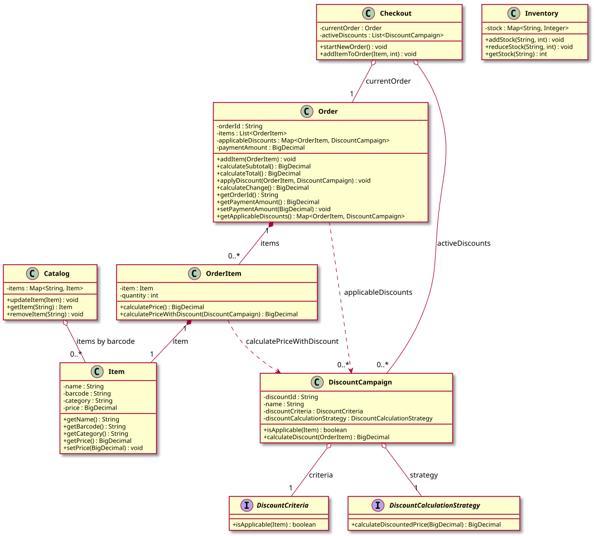

# Grocery Store System — LLD Documentation

## 1. Requirement (Problem Statement)

Design a **grocery store system** with the following behavior:

- A **catalog** of items (name, barcode, category, price) and an **inventory** tracking stock per barcode.
- **Checkout** allows starting a new order, adding items with quantity, and computing totals. Multiple **discount campaigns** can be active; when an item is added, the system applies the **best applicable discount** (lowest price) per line item.
- **Discount campaigns** are composed of: (1) **criteria** (whether the discount applies to an item, e.g., by category) and (2) a **calculation strategy** (how to compute the discounted price from the original line total). Criteria and calculation are **pluggable** so new discount types can be added without changing checkout or order logic.
- **Orders** maintain line items, applicable discounts per line, subtotal, total after discounts, and payment amount; they support calculating change.

**In short:** A grocery store with catalog and inventory, checkout that builds orders and applies the best applicable discount per item using pluggable criteria and calculation strategies, and order totals with payment and change.

---

## 2. Entities

| Entity | Type | Responsibility |
|--------|------|----------------|
| **Item** | Class | Product: `name`, `barcode`, `category`, `price`; mutable price. |
| **Catalog** | Class | Map of items by barcode: `updateItem`, `getItem`, `removeItem`. |
| **Inventory** | Class | Stock per barcode: `addStock`, `reduceStock`, `getStock`. |
| **OrderItem** | Class | Line item: references `Item`, `quantity`; `calculatePrice()` (unit × qty), `calculatePriceWithDiscount(DiscountCampaign)` delegates to campaign. |
| **Order** | Class | `orderId`, list of `OrderItem`, map of `OrderItem` → `DiscountCampaign` for applicable discounts; `calculateSubtotal`, `calculateTotal` (using discounts), `applyDiscount`, `paymentAmount`, `calculateChange`. |
| **DiscountCriteria** | Interface | Contract: `isApplicable(Item)` → boolean. |
| **DiscountCalculationStrategy** | Interface | Contract: `calculateDiscountedPrice(BigDecimal originalPrice)` → discounted amount. |
| **DiscountCampaign** | Class | `discountId`, `name`, `DiscountCriteria`, `DiscountCalculationStrategy`; `isApplicable(Item)` delegates to criteria, `calculateDiscount(OrderItem)` uses strategy on line total. |
| **Checkout** | Class | Holds list of active `DiscountCampaign`; `startNewOrder`, `addItemToOrder(item, quantity)` — creates `OrderItem`, adds to current order, and applies best applicable discount per line (compares campaigns, keeps lowest price). |

---

## 3. Class Diagram

*Source: [diagrams/class-diagram.puml](diagrams/class-diagram.puml) — SVG is generated by the [PlantUML GitHub Action](../../../.github/workflows/plantuml.yml) at the repo root.*

---

## 4. Extensibility

- **New discount criteria:** Implement `DiscountCriteria` (e.g., category-based, barcode-based, minimum-quantity) and use it in a `DiscountCampaign`. No change to `Checkout` or `Order`.
- **New discount calculations:** Implement `DiscountCalculationStrategy` (e.g., percentage off, fixed amount, BOGO) and use it in a `DiscountCampaign`. Criteria and strategy are independent; mix and match per campaign.
- **New campaign types:** Compose new `DiscountCampaign` instances from existing or new criteria and strategies; register them in the active list passed to `Checkout`.
- **Catalog and inventory:** `Catalog` and `Inventory` are separate; extensions (e.g., low-stock alerts, reservations) can wrap or extend them without touching checkout or discount logic.
- **Order lifecycle:** `Order` is a clear aggregate (items + discounts + payment); extensions like persistence, refunds, or loyalty can build on this without changing the core discount application flow.

The separation of **entities** (item, catalog, inventory, order, order item), **criteria** (who gets a discount), and **strategy** (how the discount is calculated) keeps the design open for new discount behaviors with minimal changes to existing classes.
