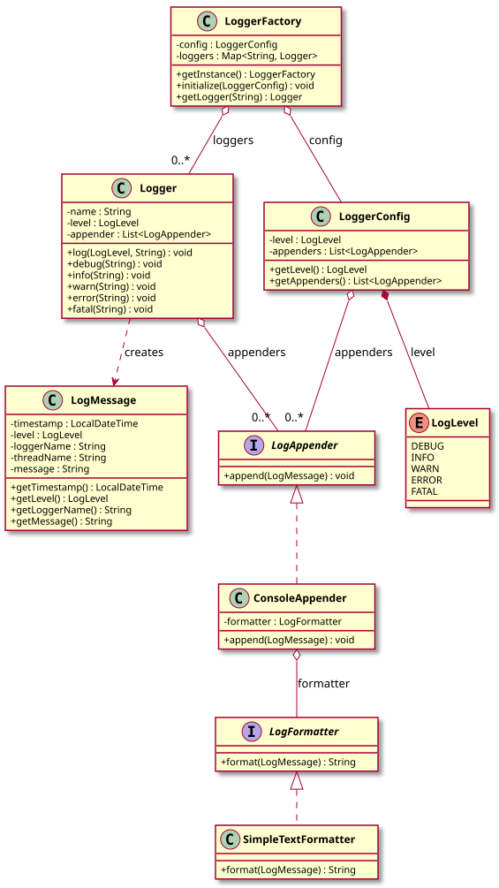

# Logging Framework — LLD Documentation

## 1. Requirement (Problem Statement)

Design a **logging framework** with the following behavior:

- **Log levels** (DEBUG, INFO, WARN, ERROR, FATAL) with hierarchical filtering: a logger configured at a level only emits messages at that level or higher.
- **Loggers** are obtained by name from a **LoggerFactory** (singleton); each logger has a minimum level and a list of **appenders**.
- **Log messages** carry timestamp, level, logger name, thread name, and message text.
- **Appenders** define where log output goes (e.g., console); each appender can use a **formatter** to turn a `LogMessage` into a string. Formatters and appenders are **pluggable** so new sinks (file, network) and formats (JSON, XML) can be added without changing logger logic.
- **LoggerConfig** holds the default level and appenders used by the factory when creating new loggers.

**In short:** A configurable logging framework with level-based filtering, pluggable appenders and formatters, and a factory for named loggers.

---

## 2. Entities

| Entity | Type | Responsibility |
|--------|------|----------------|
| **LogLevel** | Enum | DEBUG(1) … FATAL(5); `isGreaterOrEqual(LogLevel)` for filtering. |
| **LogMessage** | Class | Immutable: `timestamp`, `level`, `loggerName`, `threadName`, `message`. |
| **LogFormatter** | Interface | Contract: `format(LogMessage)` → String. |
| **SimpleTextFormatter** | Class | Implements `LogFormatter`: formats as timestamp, thread, level, logger name, message. |
| **LogAppender** | Interface | Contract: `append(LogMessage)`. |
| **ConsoleAppender** | Class | Implements `LogAppender`; holds a `LogFormatter`, writes formatted message to stdout. |
| **Logger** | Class | `name`, `level`, list of `LogAppender`. `log(level, message)` only forwards if message level ≥ logger level; creates `LogMessage` and passes to each appender. Convenience methods: `debug`, `info`, `warn`, `error`, `fatal`. |
| **LoggerConfig** | Class | Holds `LogLevel` and list of `LogAppender`; used as default when creating loggers. |
| **LoggerFactory** | Class | Singleton; `initialize(LoggerConfig)`; `getLogger(name)` returns cached or newly created `Logger` with config’s level and appenders. |

---

## 3. Class Diagram

*Source: [diagrams/class-diagram.puml](diagrams/class-diagram.puml) — SVG is generated by the [PlantUML GitHub Action](../../../.github/workflows/plantuml.yml) at the repo root.*

---

## 4. Extensibility

- **New formatters:** Implement `LogFormatter` (e.g., JSON, XML, CSV) and pass to an appender. No change to `Logger` or level logic.
- **New appenders:** Implement `LogAppender` (e.g., file, rolling file, network) and add to `LoggerConfig`; optionally use a different `LogFormatter` per appender. No change to `Logger`.
- **New log levels:** Extend `LogLevel` enum and update `isGreaterOrEqual` ordering; add convenience methods on `Logger` if desired.
- **Per-logger overrides:** Factory can be extended to support per-name level or appender overrides while still using `LoggerConfig` as default.

The separation of **level filtering** (Logger), **output destination** (Appender), and **message format** (Formatter) keeps the design open for new behaviors with minimal changes to existing classes.
