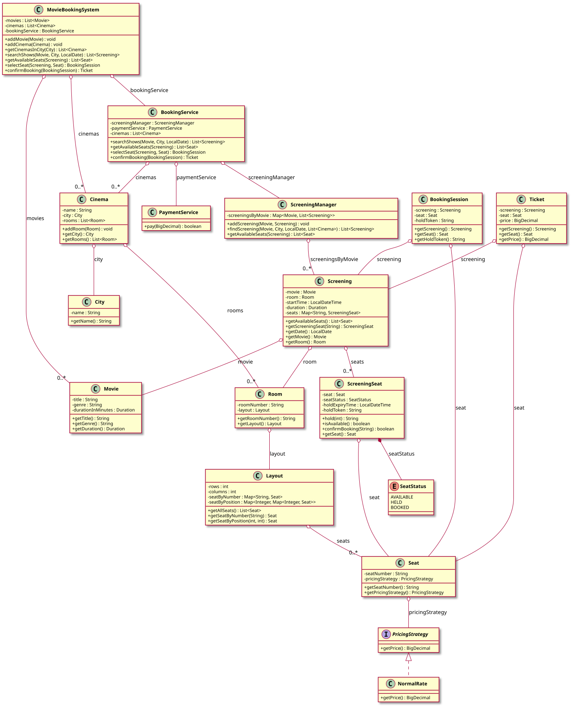

# Movie Booking System — LLD Documentation

## 1. Requirement (Problem Statement)

Design a **movie booking system** with the following behavior:

- **Admin setup:** **MovieBookingSystem** holds lists of **Movie** and **Cinema**. Each **Cinema** belongs to a **City** and has **Room**s; each **Room** has a **Layout** (rows × columns) and a set of **Seat**s. Each **Seat** has a seat number and a **PricingStrategy** (e.g., NormalRate) for the price. **ScreeningManager** maintains screenings by movie; a **Screening** is a (Movie, Room, start time, duration) and has **ScreeningSeat**s (one per seat) with status: AVAILABLE, HELD, or BOOKED.
- **User journey:** Search shows by movie, city, and date → list of **Screening**; get available seats for a screening → list of **Seat**; select seat → **hold** for a time (ScreeningSeat goes to HELD with expiry and hold token); **BookingSession** holds screening, seat, and hold token; **confirmBooking(session)** → **PaymentService** pays seat price, then **ScreeningSeat.confirmBooking(token)** marks seat BOOKED and returns a **Ticket** (screening, seat, price). If payment fails or hold expired, an exception is thrown.
- **ScreeningSeat** is thread-safe: hold sets status HELD and expiry; **isAvailable()** and **confirmBooking(token)** clean up expired holds. **BookingService** orchestrates search, available seats, select seat (hold), and confirm (pay + confirm). **MovieBookingSystem** exposes admin APIs (add movie, add cinema, get cinemas by city) and user APIs (search, available seats, select seat, confirm booking) delegating to **BookingService**.

**In short:** A cinema system where users search screenings by movie/city/date, select a seat (temporary hold), then pay and confirm to get a ticket; seats use pluggable pricing and time-limited holds.

---

## 2. Entities

| Entity | Type | Responsibility |
|--------|------|----------------|
| **City** | Class | `name`. |
| **Movie** | Class | `title`, `genre`, `durationInMinutes`. |
| **PricingStrategy** | Interface | Contract: `getPrice()` → BigDecimal. |
| **NormalRate** | Class | Implements `PricingStrategy`; returns fixed price. |
| **Seat** | Class | `seatNumber`, `pricingStrategy`; `getSeatNumber()`, `getPricingStrategy()`. |
| **Layout** | Class | rows × columns; map of seat number → Seat, map of (row, col) → Seat; `getAllSeats()`, `getSeatByNumber`, `getSeatByPosition`. |
| **Room** | Class | `roomNumber`, `layout`. |
| **Cinema** | Class | `name`, `city`, list of `Room`; `addRoom`, `getCity`, `getRooms`. |
| **SeatStatus** | Enum | AVAILABLE, HELD, BOOKED. |
| **ScreeningSeat** | Class | Wraps `Seat`; `seatStatus`, `holdExpiryTime`, `holdToken`. `hold(minutes)` → token or null; `isAvailable()` (cleans expired); `confirmBooking(token)` → boolean (cleans expired, validates token, sets BOOKED). Synchronized for thread safety. |
| **Screening** | Class | `movie`, `room`, `startTime`, `duration`; map of seat number → ScreeningSeat. `getAvailableSeats()`, `getScreeningSeat(seatNumber)`, `getDate()`. |
| **ScreeningManager** | Class | Map Movie → list of Screening; `addScreening(movie, screening)`; `findScreening(movie, city, date, cinemas)` filters by city rooms and date; `getAvailableSeats(screening)`. |
| **PaymentService** | Class | `pay(amount)` → boolean (e.g., stub). |
| **BookingSession** | Class | `screening`, `seat`, `holdToken`. |
| **Ticket** | Class | `screening`, `seat`, `price`. |
| **BookingService** | Class | Holds `ScreeningManager`, `PaymentService`, list of `Cinema`. `searchShows(movie, city, date)`; `getAvailableSeats(screening)`; `selectSeat(screening, seat)` → hold, return BookingSession; `confirmBooking(session)` → pay, then confirm seat, return Ticket. |
| **MovieBookingSystem** | Class | Lists of Movie, Cinema; BookingService. Admin: addMovie, addCinema, getCinemasInCity. User: searchShows, getAvailableSeats, selectSeat, confirmBooking. |

---

## 3. Class Diagram

*Source: [diagrams/class-diagram.puml](diagrams/class-diagram.puml) — SVG is generated by the [PlantUML GitHub Action](../../../.github/workflows/plantuml.yml) at the repo root.*

---

## 4. Extensibility

- **New pricing strategies:** Implement `PricingStrategy` (e.g., premium, discount) and assign to Seat; BookingService and ScreeningSeat unchanged. No change to hold/confirm flow.
- **New cities/cinemas/rooms:** Add via MovieBookingSystem and ScreeningManager; search and booking logic unchanged.
- **Hold expiry policy:** ScreeningSeat.hold(minutes) is configurable; cleanup on isAvailable/confirmBooking. No change to BookingService.
- **Payment providers:** Replace or wrap PaymentService with different implementations; BookingService still calls pay(amount). No change to screening or seat logic.

The separation of **screening discovery** (ScreeningManager), **seat state** (ScreeningSeat, hold/confirm), **pricing** (PricingStrategy), and **booking flow** (BookingService) keeps the design open for new movies, locations, pricing, and payment with minimal changes to existing classes.
