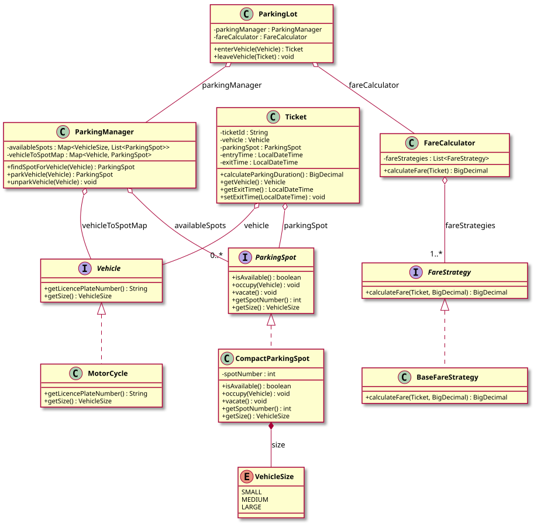

# Parking Lot System — LLD Documentation

## 1. Requirement (Problem Statement)

Design a **parking lot system** with the following behavior:

- **Parking spots** come in sizes (SMALL, MEDIUM, LARGE); each spot can be available or occupied. A **vehicle** has a size; it can park in a spot of that size or larger (smallest fitting spot preferred).
- **ParkingManager** maintains a map of spots by size and assigns a vehicle to the smallest available spot that fits. It tracks which vehicle is in which spot for unparking.
- **ParkingLot** is the facade: `enterVehicle(vehicle)` uses ParkingManager to park and returns a **Ticket** (vehicle, spot, entry time); `leaveVehicle(ticket)` sets exit time, unparks via ParkingManager, and computes **fare** via a **FareCalculator**.
- **Fare calculation** is **pluggable**: one or more **FareStrategy** implementations can be chained (e.g., base fare by duration, then discounts). Each strategy receives the ticket and current fare and returns an updated fare. **FareCalculator** applies all strategies in order.
- **Ticket** holds vehicle, spot, entry time, exit time; it supports computing parking duration for fare calculation.

**In short:** A parking lot where vehicles get a ticket on entry, park in the smallest fitting spot, and on exit pay a fare computed by pluggable, chainable fare strategies.

---

## 2. Entities

| Entity | Type | Responsibility |
|--------|------|----------------|
| **VehicleSize** | Enum | SMALL, MEDIUM, LARGE (for spots and vehicles). |
| **Vehicle** | Interface | `getLicencePlateNumber()`, `getSize()`. |
| **MotorCycle** | Class | Implements `Vehicle`; small size. |
| **ParkingSpot** | Interface | `isAvailable()`, `occupy(Vehicle)`, `vacate()`, `getSpotNumber()`, `getSize()`. |
| **CompactParkingSpot** | Class | Implements `ParkingSpot`; fixed size (e.g., SMALL). |
| **Ticket** | Class | `ticketId`, `vehicle`, `parkingSpot`, `entryTime`, `exitTime`; `calculateParkingDuration()` for fare logic. |
| **ParkingManager** | Class | Map of `VehicleSize` → list of spots; map of vehicle → spot. `findSpotForVehicle(vehicle)` returns smallest fitting available spot; `parkVehicle(vehicle)` assigns spot and marks occupied; `unparkVehicle(vehicle)` vacates spot and returns to pool. |
| **FareStrategy** | Interface | Contract: `calculateFare(Ticket, BigDecimal inputFare)` → BigDecimal. |
| **BaseFareStrategy** | Class | Implements `FareStrategy`: computes fare from duration (e.g., per-minute base rate). |
| **FareCalculator** | Class | Holds list of `FareStrategy`; `calculateFare(ticket)` applies each strategy in sequence (output of one is input to next). |
| **ParkingLot** | Class | Holds `ParkingManager` and `FareCalculator`. `enterVehicle(vehicle)` → Ticket or null; `leaveVehicle(ticket)` sets exit time, unparks, prints fare. |
| **ParkingLotSystem** | Class | Demo: creates spots, manager, fare strategies, calculator, parking lot; enters/leaves vehicles. |

---

## 3. Class Diagram

*Source: [diagrams/class-diagram.puml](diagrams/class-diagram.puml) — SVG is generated by the [PlantUML GitHub Action](../../../.github/workflows/plantuml.yml) at the repo root.*

---

## 4. Extensibility

- **New vehicle types:** Implement `Vehicle` with appropriate size; ParkingManager and spot logic remain unchanged.
- **New spot types:** Implement `ParkingSpot` (e.g., LargeParkingSpot, ElectricSpot); register in ParkingManager’s size map. No change to fare or ticket logic.
- **New fare strategies:** Implement `FareStrategy` (e.g., discount for long stay, premium for large vehicles) and add to FareCalculator’s list. Strategies are chainable; order matters. No change to ParkingLot or ParkingManager.
- **Multiple lots or floors:** ParkingLot could be extended to hold multiple ParkingManagers or a hierarchy of lots; FareCalculator could take lot/floor into account via strategy parameters.

The separation of **allocation** (ParkingManager), **fare calculation** (FareStrategy chain), and **facade** (ParkingLot) keeps the design open for new vehicle/spot types and pricing rules with minimal changes to existing classes.
