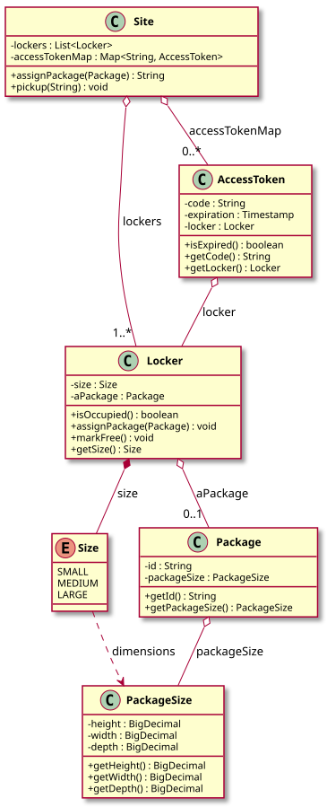

# Shipping Locker System — LLD Documentation

## 1. Requirement (Problem Statement)

Design a **shipping locker system** with the following behavior:

- A **Site** has a list of **Lockers**; each locker has a **Size** (SMALL, MEDIUM, LARGE) with dimensions (height, width, depth). A locker is either available or occupied by one **Package**.
- **Package** has an id and a **PackageSize** (height, width, depth). **assignPackage(package)** finds the smallest locker that fits the package (dimensions ≤ locker size), assigns the package to that locker, generates an **AccessToken** (code, expiration, locker), and returns the code. If no locker fits, an exception is thrown.
- **pickup(code)** validates the token (exists, not expired), marks the locker free, and removes the token. Expired or invalid codes throw.
- **AccessToken** holds code, expiration timestamp, and reference to the locker; **isExpired()** compares current time to expiration (e.g., 7 days). **Size** enum provides dimensions for matching; **PackageSize** is a value object for package dimensions.

**In short:** A site with size-tiered lockers; packages are assigned to the smallest fitting locker and retrieved with a time-limited access code.

---

## 2. Entities

| Entity | Type | Responsibility |
|--------|------|----------------|
| **Size** | Enum | SMALL, MEDIUM, LARGE; each has `height`, `width`, `depth` (BigDecimal). Used for locker dimensions. |
| **PackageSize** | Class | Value object: `height`, `width`, `depth` (BigDecimal). Used for package dimensions. |
| **Package** | Class | `id`, `packageSize`; immutable. |
| **Locker** | Class | `size` (Size); holds optional `Package`. `isOccupied()`, `assignPackage(package)`, `markFree()`, `getSize()`. |
| **AccessToken** | Class | `code`, `expiration` (Timestamp), `locker`; `isExpired()` compares current time to expiration. |
| **Site** | Class | List of `Locker`; map of code → AccessToken. `assignPackage(package)`: map package to Size via `getSizeForPackage(packageSize)` (smallest Size that fits), find available locker of that size via `getAvailableLocker(size)`, assign package to locker, create token (e.g., 7-day expiry), store token, return code. `pickup(code)`: validate token, check not expired, mark locker free, remove token. |
| **ShippingLockerSystemDemo** | Class | Demo: creates site with lockers, assigns packages, pickup by code; demonstrates no locker for oversized package. |

---

## 3. Class Diagram

*Source: [diagrams/class-diagram.puml](diagrams/class-diagram.puml) — SVG is generated by the [PlantUML GitHub Action](../../../.github/workflows/plantuml.yml) at the repo root.*

---

## 4. Extensibility

- **New locker sizes:** Add to `Size` enum with dimensions; Site’s `getSizeForPackage` and `getAvailableLocker` work unchanged. No change to Package or AccessToken.
- **Expiration policy:** AccessToken creation (in Site) can use configurable duration or rules. No change to Locker or Package.
- **Multiple sites:** Site is self-contained; a higher-level service could manage multiple sites and route by location. No change to Locker or token logic.
- **Notifications:** Site could register observers or call a notification service when a package is assigned (e.g., send code to customer) or when token is about to expire.

The separation of **allocation** (Site), **storage** (Locker, Package), and **access** (AccessToken) keeps the design open for new sizes and policies with minimal changes to existing classes.
