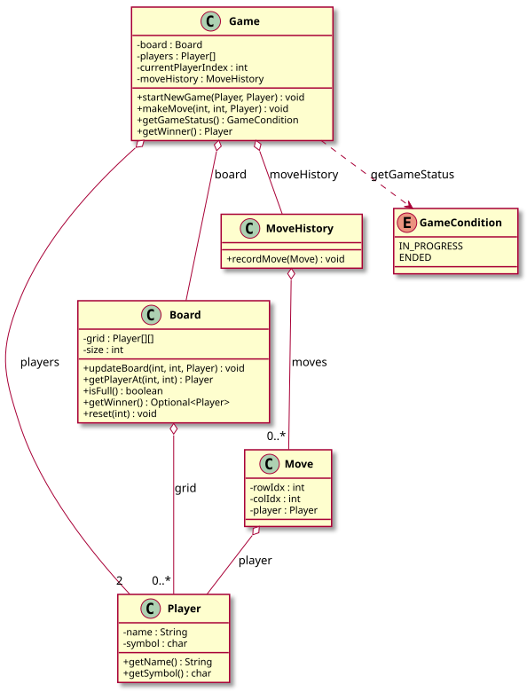

# Tic-Tac-Toe — LLD Documentation

## 1. Requirement (Problem Statement)

Design a **Tic-Tac-Toe** game with the following behavior:

- A **Board** is an N×N grid (e.g., 3×3); each cell can be empty or occupied by a **Player**. Players have a name and a symbol (e.g., 'X', 'O').
- **Game** holds the board, two players, current player index, and **MoveHistory**. It enforces turn order: only the current player can make a move; moves are valid only on empty cells. After a move, the board is updated, the move is recorded, and the turn switches.
- **Game status** is either IN_PROGRESS or ENDED (winner or board full). **Board** provides `getWinner()` (checks rows, columns, diagonals) and `isFull()`; **Game** exposes `getGameStatus()` and `getWinner()`.
- **MoveHistory** records moves (row, col, player) for replay or undo; **Move** is an immutable record of a single move.

**In short:** A two-player Tic-Tac-Toe game with a configurable board size, turn enforcement, win/draw detection, and move history.

---

## 2. Entities

| Entity | Type | Responsibility |
|--------|------|----------------|
| **Player** | Class | `name`, `symbol` (e.g., 'X', 'O'). |
| **Board** | Class | N×N grid of `Player` (nullable); `updateBoard(row, col, player)`, `getPlayerAt(row, col)`, `isFull()`, `getWinner()` (Optional&lt;Player&gt;), `reset(size)`. |
| **Move** | Class | Immutable: `rowIdx`, `colIdx`, `player`. |
| **MoveHistory** | Class | Records list of `Move`; `recordMove(Move)`. |
| **GameCondition** | Enum | IN_PROGRESS, ENDED. |
| **Game** | Class | `board`, `players[2]`, `currentPlayerIndex`, `moveHistory`. `startNewGame(A, B)` resets board and players. `makeMove(row, col, player)` validates turn and cell, updates board, records move, switches turn. `getGameStatus()` → IN_PROGRESS or ENDED; `getWinner()` → Player or null. |
| **TicTacToeDemo** | Class | Demo: creates players and game; makes moves; prints winner or draw. |

---

## 3. Class Diagram

*Source: [diagrams/class-diagram.puml](diagrams/class-diagram.puml) — SVG is generated by the [PlantUML GitHub Action](../../../.github/workflows/plantuml.yml) at the repo root.*

---

## 4. Extensibility

- **Larger grid / different win rules:** Board can be extended with configurable size and win-line length; Game remains the orchestrator. No change to Player or Move.
- **Move history / undo:** MoveHistory already records moves; Game could support undo by popping the last move and reverting the board. No change to Board or Player.
- **AI player:** A Player could be backed by an AI that chooses (row, col); Game’s makeMove interface stays the same. No change to Board or MoveHistory.
- **Replay:** MoveHistory can be replayed on a fresh Board for analysis or display.

The separation of **board state** (Board), **game flow** (Game), and **history** (MoveHistory, Move) keeps the design open for new rules and features with minimal changes to existing classes.
