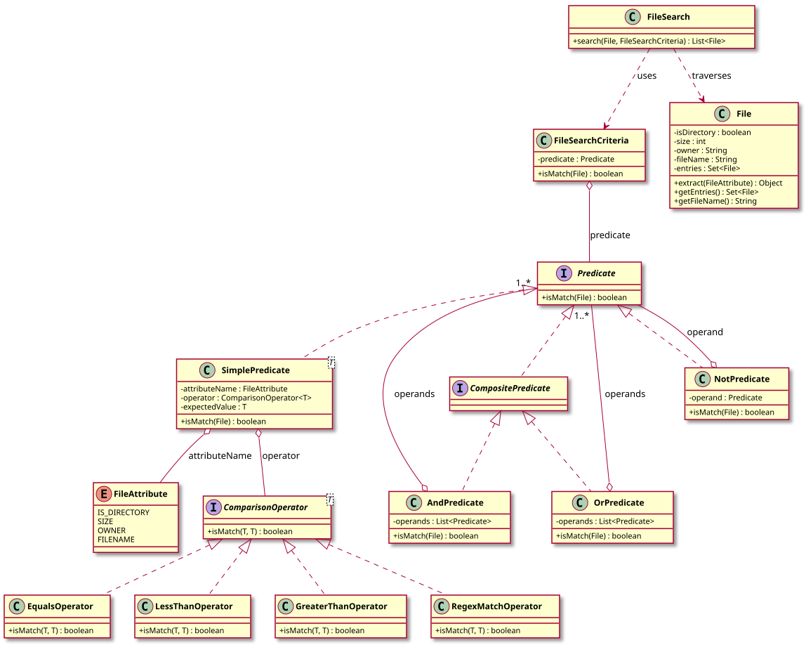

# Unix File Search — LLD Documentation

## 1. Requirement (Problem Statement)

Design a **Unix-like file search** system with the following behavior:

- **Files** can represent either files or directories; each has attributes: `isDirectory`, `size`, `owner`, `fileName`. Directories contain a set of child entries (files/directories); traversal is recursive.
- **Search** starts from a root file (directory) and returns all entries (recursively) that match a given **criteria**.
- **Criteria** are expressed as **predicates** over a file: a predicate answers `isMatch(File)` → boolean. Predicates are **pluggable** and composable (e.g., AND, OR, NOT of other predicates).
- **Simple predicates** compare a **file attribute** (e.g., SIZE, OWNER, FILENAME, IS_DIRECTORY) against an expected value using a **comparison operator** (e.g., equals, less-than, greater-than, regex match). Operators are **pluggable** and generic over the attribute type.
- **Composite predicates** (AndPredicate, OrPredicate, NotPredicate) combine other predicates so complex queries (e.g., "size > 100 AND owner = 'admin'") can be built without changing the search engine.

**In short:** A recursive file search that uses pluggable, composable predicates (simple attribute comparisons and AND/OR/NOT) to filter files under a root directory.

---

## 2. Entities

| Entity | Type | Responsibility |
|--------|------|----------------|
| **FileAttribute** | Enum | Attribute to filter on: `IS_DIRECTORY`, `SIZE`, `OWNER`, `FILENAME`. |
| **File** | Class | Represents file or directory: `isDirectory`, `size`, `owner`, `fileName`, `entries` (children). `extract(FileAttribute)` returns attribute value; `getEntries()` for traversal. |
| **Predicate** | Interface | Contract: `isMatch(File)` → boolean. |
| **CompositePredicate** | Interface | Extends `Predicate`; marker for predicates that combine other predicates. |
| **SimplePredicate&lt;T&gt;** | Class | Holds `FileAttribute`, `ComparisonOperator<T>`, expected value; `isMatch(File)` extracts attribute, compares via operator. |
| **AndPredicate** | Class | Implements `CompositePredicate`; holds list of `Predicate`; matches when all match. |
| **OrPredicate** | Class | Implements `CompositePredicate`; holds list of `Predicate`; matches when any match. |
| **NotPredicate** | Class | Implements `Predicate`; holds one `Predicate`; matches when operand does not match. |
| **ComparisonOperator&lt;T&gt;** | Interface | Contract: `isMatch(T attributeValue, T expectedValue)` → boolean. |
| **EqualsOperator**, **LessThanOperator**, **GreaterThanOperator**, **RegexMatchOperator** | Classes | Implement `ComparisonOperator` for equality, numeric comparison, regex. |
| **FileSearchCriteria** | Class | Wraps a single `Predicate`; `isMatch(File)` delegates to predicate. |
| **FileSearch** | Class | `search(root File, criteria FileSearchCriteria)`: iterative (stack-based) traversal, collects all files for which `criteria.isMatch(file)` is true; returns list of matching files. |

---

## 3. Class Diagram

*Source: [diagrams/class-diagram.puml](diagrams/class-diagram.puml) — SVG is generated by the [PlantUML GitHub Action](../../../.github/workflows/plantuml.yml) at the repo root.*

---

## 4. Extensibility

- **New attributes:** Add to `FileAttribute` enum and handle in `File.extract()`; add corresponding `ComparisonOperator` implementations if needed. No change to predicates or search.
- **New operators:** Implement `ComparisonOperator<T>` (e.g., contains, starts-with) and use in `SimplePredicate`. No change to `FileSearch` or composite predicates.
- **New composite logic:** Implement `Predicate` (or `CompositePredicate`) that combines other predicates (e.g., N-of-M). No change to `FileSearch` or simple predicates.
- **New traversal strategies:** `FileSearch` could be extended to accept a traversal strategy (BFS, DFS, depth limit) while still using the same criteria interface.

The separation of **traversal** (FileSearch), **criteria** (Predicate / FileSearchCriteria), and **comparison** (ComparisonOperator) keeps the design open for new query types and operators with minimal changes to existing classes.
