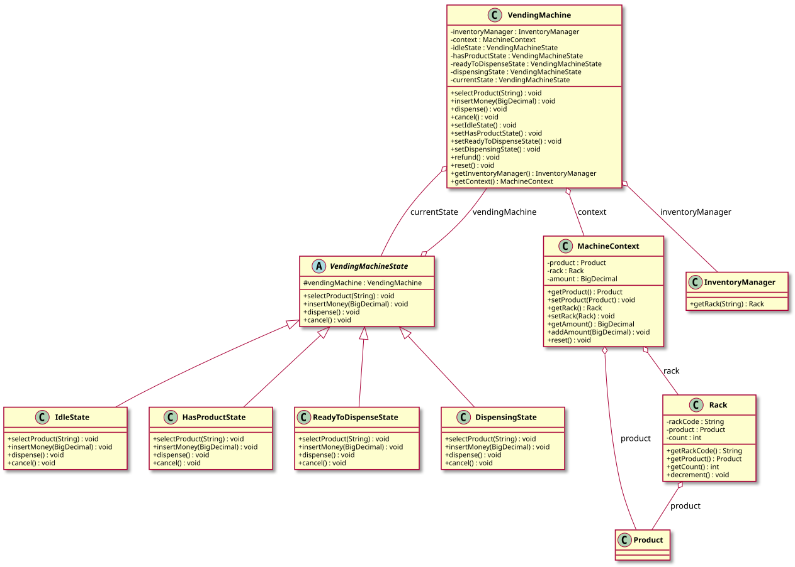

# Vending Machine — LLD Documentation

## 1. Requirement (Problem Statement)

Design a **vending machine** with the following behavior:

- The machine has **states**: Idle (no product selected), HasProduct (product selected, awaiting money), ReadyToDispense (enough money inserted), Dispensing (dispensing product). User actions (select product, insert money, dispense, cancel) are **delegated to the current state**; each state implements the same interface and either performs the action or rejects it (e.g., "select product first" when in Idle).
- **State transitions**: Idle → HasProduct (on select product); HasProduct → ReadyToDispense (on insert enough money) or Idle (on cancel); ReadyToDispense → Dispensing (on dispense); Dispensing → Idle (after dispensing and reset). **MachineContext** holds the current selection: product, rack, and amount inserted; it is reset when returning to Idle.
- **Inventory** is managed by **InventoryManager**: racks (by rack code) hold a **Product** and a count. Selecting a product loads the rack and product into context; dispensing decrements the rack count.
- **Refund** and **reset** are used when canceling or after dispensing. The machine is **thread-safe** (synchronized) for the main actions.

**In short:** A state-machine–driven vending machine where user actions are handled by the current state, context holds selection and amount, and inventory (racks/products) is managed separately.

---

## 2. Entities

| Entity | Type | Responsibility |
|--------|------|----------------|
| **Product** | Class | Represents a product (e.g., name, price). |
| **Rack** | Class | `rackCode`, `product`, `count`; `decrement()` when dispensing. |
| **MachineContext** | Class | Mutable: `product`, `rack`, `amount`; `addAmount`, `reset()` (clear selection and amount). |
| **InventoryManager** | Class | `getRack(rackCode)`; provides inventory to the machine. |
| **VendingMachineState** | Abstract class | Holds reference to `VendingMachine`; abstract methods: `selectProduct(rackCode)`, `insertMoney(amount)`, `dispense()`, `cancel()`. Each state implements allowed behavior and transitions. |
| **IdleState** | Class | selectProduct: load rack/product into context → HasProduct; insertMoney/dispense/cancel: no-op or message. |
| **HasProductState** | Class | selectProduct: change selection; insertMoney: add to context, if enough → ReadyToDispense; cancel: refund, reset → Idle. |
| **ReadyToDispenseState** | Class | dispense: → Dispensing; cancel: refund, reset → Idle. |
| **DispensingState** | Class | dispense: decrement rack, refund/reset → Idle. |
| **VendingMachine** | Class | Holds `InventoryManager`, `MachineContext`, and all state instances; `currentState` delegates selectProduct, insertMoney, dispense, cancel; transition methods (setIdleState, setHasProductState, etc.); `refund()`, `reset()`. Actions are synchronized. |

---

## 3. Class Diagram

*Source: [diagrams/class-diagram.puml](diagrams/class-diagram.puml) — SVG is generated by the [PlantUML GitHub Action](../../../.github/workflows/plantuml.yml) at the repo root.*

---

## 4. Extensibility

- **New states:** Add a new state class extending `VendingMachineState` and transition to/from it from existing states; add a setter on VendingMachine. No change to inventory or context shape.
- **New actions:** Extend the state interface with a new method and implement per state; call from VendingMachine. No change to existing state logic.
- **New product/rack types:** Extend Product or Rack; InventoryManager and context can hold them. No change to state machine.
- **Payment methods:** Context could hold a payment type; states could branch on payment (e.g., card vs cash). Strategies could be plugged in for payment validation.

The separation of **state behavior** (each state class), **context** (selection and amount), and **inventory** (racks/products) keeps the design open for new states and product types with minimal changes to existing classes.
