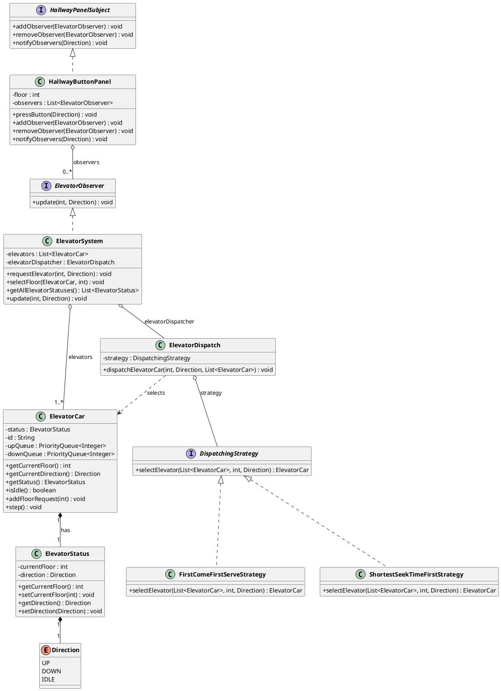

# Elevator System — LLD Documentation

## 1. Requirement (Problem Statement)

Design a **multi-elevator control system** for a building with the following behavior:

- **Multiple elevator cars** operate independently, each with a current floor and direction (UP, DOWN, or IDLE).
- **Hallway button panels** on each floor allow users to request an elevator by pressing UP or DOWN.
- When a request is made, the system must **assign one elevator** to serve that request (dispatching).
- Each elevator maintains **internal queues**: one for floors above (served in ascending order) and one for floors below (served in descending order). The elevator moves one floor per tick and switches direction when the current queue is empty.
- The **dispatching algorithm** (which elevator gets the request) should be **pluggable** (e.g., First-Come-First-Serve, Shortest-Seek-Time-First).
- Hallway panels should **notify** the central system when a button is pressed, so the system can dispatch an elevator (observer-style flow).

**In short:** Simulate a building elevator system where users press UP/DOWN at a floor, the system selects an elevator using a configurable strategy, and elevator cars move between floors serving requests from their queues.

---

## 2. Entities

| Entity | Type | Responsibility |
|--------|------|----------------|
| **Direction** | Enum | Represents travel direction: `UP`, `DOWN`, `IDLE`. |
| **ElevatorStatus** | Class | Holds `currentFloor` and `direction`; mutable state of an elevator. |
| **ElevatorCar** | Class | Physical elevator: owns `ElevatorStatus`, `upQueue`, `downQueue`. Adds requests, runs `step()` each tick to move one floor, switches direction when a queue is empty. |
| **DispatchingStrategy** | Interface | Contract: `selectElevator(elevators, floor, direction)` → chosen `ElevatorCar`. |
| **FirstComeFirstServeStrategy** | Class | Implements `DispatchingStrategy`: picks first idle or same-direction elevator; fallback random. |
| **ShortestSeekTimeFirstStrategy** | Class | Implements `DispatchingStrategy`: among direction-eligible elevators, picks the one nearest to the request floor (SSTF). |
| **ElevatorDispatch** | Class | Holds a `DispatchingStrategy`; `dispatchElevatorCar(floor, direction, elevators)` uses the strategy and adds the floor to the selected car. |
| **ElevatorObserver** | Interface | Observer contract: `update(floor, direction)` when a hallway request occurs. |
| **HallwayPanelSubject** | Interface | Subject contract: `addObserver`, `removeObserver`, `notifyObservers(direction)`. |
| **HallwayButtonPanel** | Class | Panel at a fixed `floor`; implements `HallwayPanelSubject`. On `pressButton(direction)` notifies all observers with that floor and direction. |
| **ElevatorSystem** | Class | Central controller: holds list of `ElevatorCar` and `ElevatorDispatch`. Implements `ElevatorObserver`: on `update(floor, direction)` calls `requestElevator(floor, direction)` which dispatches via `ElevatorDispatch`. Also supports `selectFloor(car, floor)` for cabin requests. |
| **ElevatorSystemDemo** | Class | Demo: creates elevators, strategy, dispatch, system, hallway panels; registers system as observer; runs a scheduler to call `step()` on cars and simulates button presses. |

---

## 3. Class Diagram (PlantUML)

---

## 4. Extensibility

- **New dispatching algorithms:** Implement `DispatchingStrategy` (e.g., look-ahead, load-based, zone-based) and pass it into `ElevatorDispatch`. No change to `ElevatorCar` or observer code.
- **New request sources:** Any component that can call `ElevatorSystem.requestElevator(floor, direction)` or implement `ElevatorObserver` and register with a `HallwayPanelSubject` can feed requests without changing core elevator or dispatch logic.
- **New panel types:** New subjects can implement `HallwayPanelSubject` and notify the same `ElevatorObserver` (e.g., `ElevatorSystem`), keeping the same dispatch pipeline.
- **Cabin buttons / destination floors:** Already supported via `ElevatorSystem.selectFloor(car, destinationFloor)`; further extensions (e.g., destination dispatch) can be added around `ElevatorSystem` and `ElevatorDispatch` without altering `ElevatorCar` internals.
- **Monitoring / logging:** Additional observers can be registered with hallway panels or a separate “system events” subject to log or display requests and elevator movements.

The separation of **entities** (car, status, direction), **strategy** (dispatching), and **observer** (panels → system) keeps the design open for new behaviors with minimal changes to existing classes.
